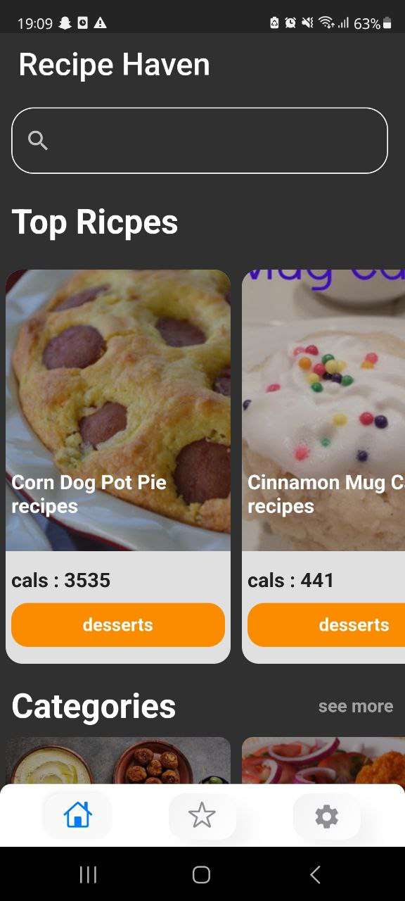
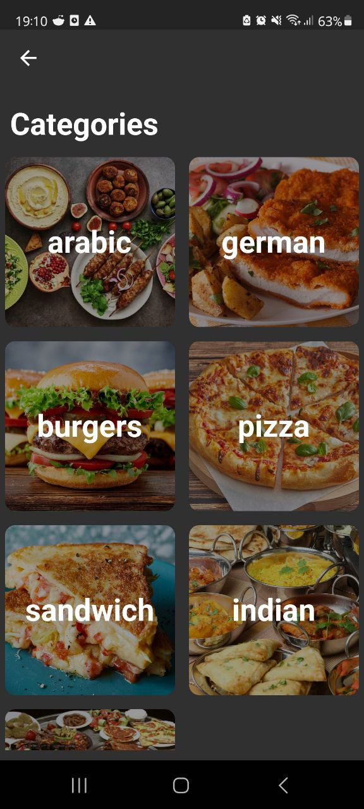
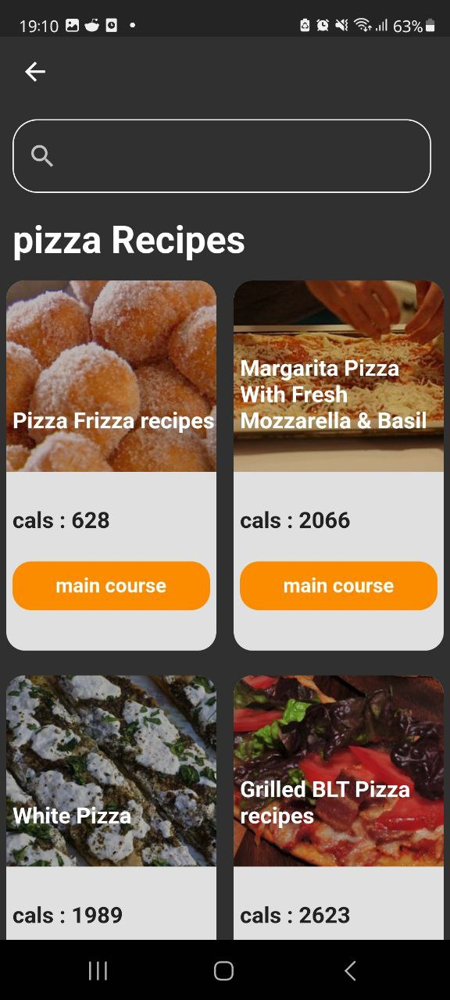
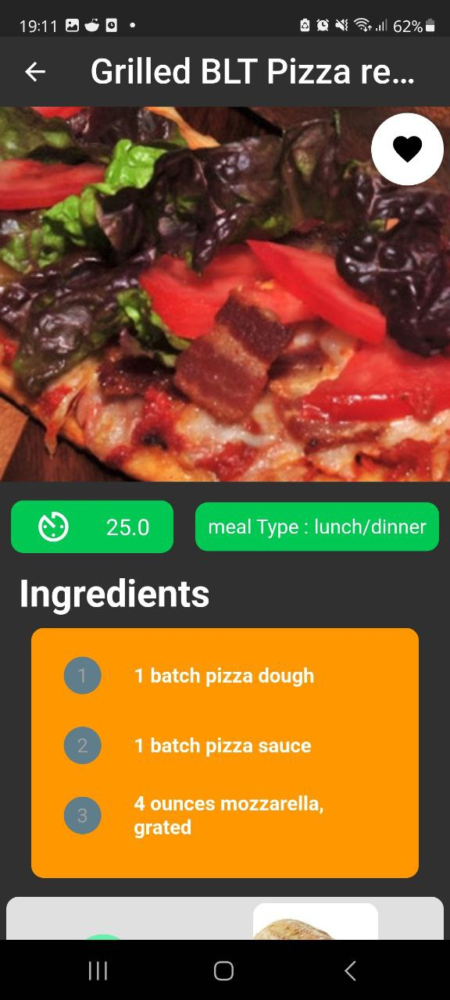
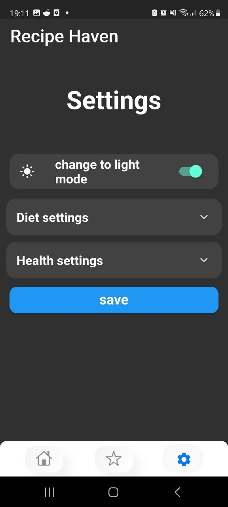
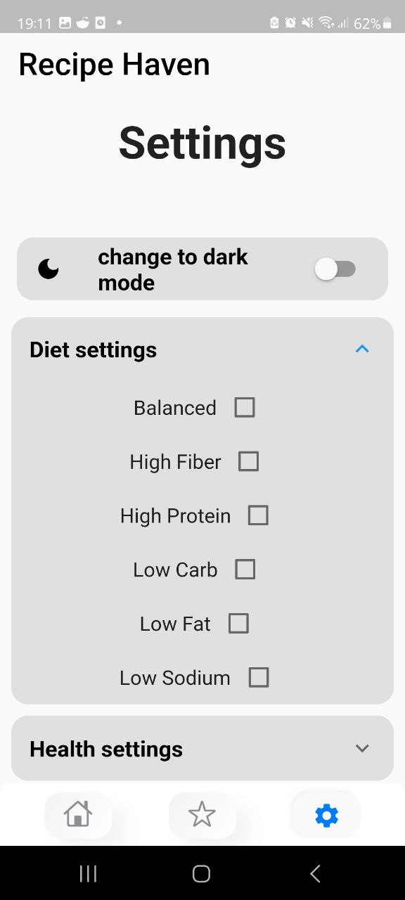

# Recipe Haven

Recipe Haven is a Flutter-based mobile app that allows users to search and discover various recipes. It provides a user-friendly interface to explore a vast collection of recipes, including detailed instructions, ingredients, and nutritional information. With Recipe Haven, users can easily find and save their favorite recipes, create personalized recipe collections.

## Key Features

- Search and browse recipes based on various criteria such as ingredients, dish types, and dietary preferences.
- View detailed recipe information, including preparation steps, cooking time, and serving size.
- Save favorite recipes for quick access and create personalized recipe collections.
- Get nutritional information for each recipe, including calorie count and macronutrient breakdown.
- Pull-to-refresh functionality for updating recipe data.
- Dark mode support for enhanced user experience.
- Error handling and user-friendly error messages.
- Smooth and intuitive UI with appealing visual design.

## Technologies Used

- Flutter: Cross-platform framework for building mobile apps.
- Dart: Programming language used for developing Flutter apps.
- GetX: State management library for managing app state and dependency injection.
- API Integration: Integration with recipe data APIs to fetch recipe information.
- Responsive Design: Ensuring the app layout adapts to different screen sizes.

## Full tutorial in youtube
[PlayList]([screenshots/photo_2023-07-15_18-57-07.jpg](https://youtube.com/playlist?list=PLWp3_-ABH006Ny2WCEEaptMY62mc_h7F4))

## Screenshots

## Getting Started

To run the Recipe Haven app on your local machine, make sure you have Flutter and Dart installed. Then, follow these steps:

1. Clone this repository: `git clone https://github.com/strngprogrammer/RecipeHaven.git`
2. Navigate to the project directory: `cd RecipeHaven`
3. Install dependencies: `flutter pub get`
4. Run the app: `flutter run`

Feel free to explore and modify the app code to suit your needs. Contributions to Recipe Haven are welcome! If you have any suggestions, bug reports, or feature requests, feel free to open an issue or submit a pull request. Let's make Recipe Haven even better together!

## License

Recipe Haven is released under the [MIT License](LICENSE).
